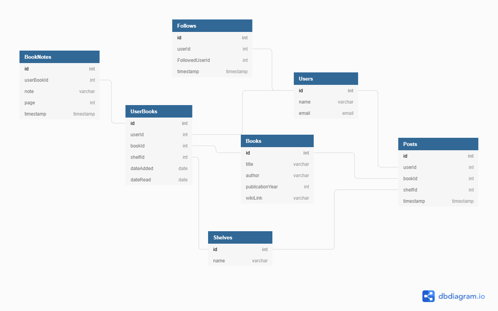

# Bookkeeper

> A user driven, open-source book repository

---

### Table of Contents

- [Description](#description)
- [Featues](#features)
- [Technologies](#technologies)
- [Installation](#installation)
- [ERD](#erd)
- [License](#license)
- [Author Info](#author-info)

---

## Description

Bookkeeper is a virtual library application for anyone wanting to store and keep track of their books in an organized fashion via the app's "shelves" feature. It also gives the user the ability to share their reading progress with other users that follow them. Reading books is a tremendous activity. Whether you're entertaining yourself, learning something new, or just decompressing after a long day, books are always there when you need them.

I wanted a virtual way to notate, share, and keep track of my books, so I built Bookkeeper. Originally, I put this application together in two weeks, mainly using React's Javascript library. My goals were to gain a better understanding of state and data relationships by incorporating full CRUD functionality, as well as becoming more familiar with the React library, specifically React Hooks and props, all while maintaining a user-friendly experience.

## Features
- Users can add or remove books to and from their personal library.
- Users can track their reading progress by organizing their books onto three different shelves.
- Users can take notes on any of the books in their library.
- Users can follow other users in order to share their reading progress with one another. 

#### Technologies

- HTML5
- CSS3
- Javascript
- React
- Git
- Github
- JSON Server
- Visual Studio Code

---


#### Installation
1. Clone this repository and change to the directory in the terminal.

```sh
git clone git@github.com:luciidlou/book-keeper.git
cd book-keeper
```
2. Access the data

<a href="https://github.com/luciidlou/book-keeper-api" target="_blank" rel="noreferrer"></a>

3. Launch the application

```sh
npm install
npm start
```

---
### Demo


#### ERD

---

## License

MIT License

Copyright (c) [2021] [Alex J Lewis]

Permission is hereby granted, free of charge, to any person obtaining a copy
of this software and associated documentation files (the "Software"), to deal
in the Software without restriction, including without limitation the rights
to use, copy, modify, merge, publish, distribute, sublicense, and/or sell
copies of the Software, and to permit persons to whom the Software is
furnished to do so, subject to the following conditions:

The above copyright notice and this permission notice shall be included in all
copies or substantial portions of the Software.

THE SOFTWARE IS PROVIDED "AS IS", WITHOUT WARRANTY OF ANY KIND, EXPRESS OR
IMPLIED, INCLUDING BUT NOT LIMITED TO THE WARRANTIES OF MERCHANTABILITY,
FITNESS FOR A PARTICULAR PURPOSE AND NONINFRINGEMENT. IN NO EVENT SHALL THE
AUTHORS OR COPYRIGHT HOLDERS BE LIABLE FOR ANY CLAIM, DAMAGES OR OTHER
LIABILITY, WHETHER IN AN ACTION OF CONTRACT, TORT OR OTHERWISE, ARISING FROM,
OUT OF OR IN CONNECTION WITH THE SOFTWARE OR THE USE OR OTHER DEALINGS IN THE
SOFTWARE.

---

## Author Info

- Github - [luciidlou](https://github.com/luciidlou)
- LinkedIn - [Alex Lewis](https://www.linkedin.com/in/alex-lewis22/)

[Back To The Top](#bookkeeper)